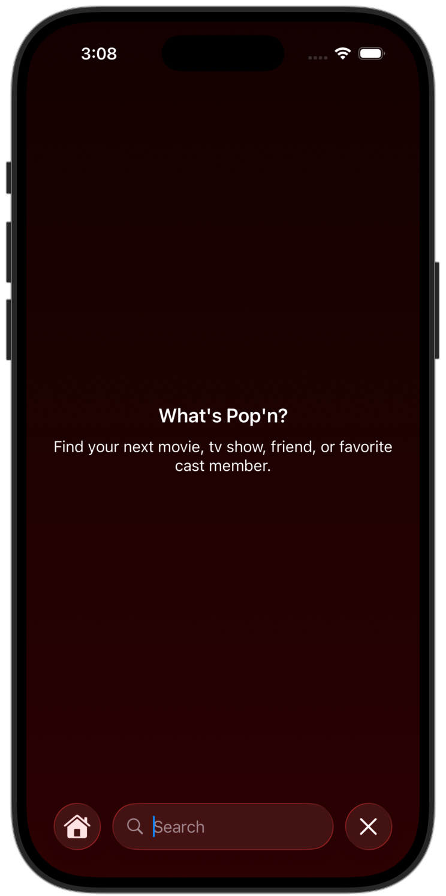
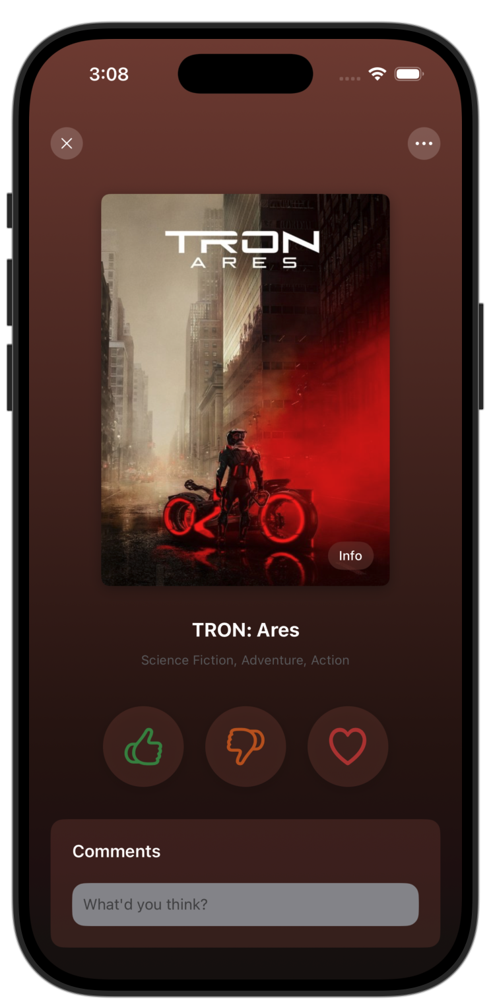

[![Swift Version][swift-image]][swift-url]

# Pop'n — MovieNight
<br />
<p align="center">
  <a href="https://github.com/boon5/MovieNight">
    
  </a>
  <p align="center">
    A modern iOS app for discovering, rating, organizing and sharing movies and TV shows — like Spotify but for film and TV.
  </p>
</p>

<p align="center">


</p>

Pop'n (a.k.a. MovieNight) is an evolving SwiftUI app that helps users discover upcoming movies and TV shows, rate and favorite titles, build a personal library, and pick something to watch when indecision strikes.

**Key ideas:** lightweight discovery, simple binary rating (thumbs up/down), favoriting (heart), quick random selection for what to watch, and personal tags for tracking progress.

## Features

- **Search & Discovery:** Search across movies and TV shows and browse upcoming releases and trending titles.
- **Rate Titles:** Give a thumbs up, thumbs down, or heart to quickly express how you feel about a title.
- **Favorites / Library:** Favorited titles are saved to your personal library for quick access later.
- **Watch Later Queue:** Add titles to a "Watch Later" list and reorder or curate it.
- **Spin The Wheel:** When you can't decide, spin a wheel to randomly pick an item from your Watch Later list.
- **Progress Tags:** Tag movies/episodes with statuses such as "Started", "Finished", "Paused", and custom tags whenever you begin or end watching.
- **Collections:** Create and explore collections (e.g., "Date Night", "Sci‑Fi Classics").
- **Trailers & Media:** View trailers and rich metadata (cast, crew, runtime, release dates).
- **Lightweight Social (Planned):** Create shareable playlists (watchlists) to exchange with friends.

> This app is a work in progress — not all features are finished and the design/UX will continue to evolve.

## Requirements

- iOS 26.0+ (target may be updated as the project evolves)
- Xcode 26+ (recommend latest stable)
- `mise` for development tool management (optional)

## Architecture & Tech

- SwiftUI for UI and navigation
- Combine / async-await for networking and reactive flows
- Tuist to manage and generate Xcode projects
- Core Data (or lightweight persistence) for local library, tags and watch lists

> This is most likely to be changed to The Composable Architecture (TCA) and SwiftData in future iterations.

## Installation

#### Mise (optional)
This project includes a `mise.toml` to help manage developer tools. To install Mise, run the following commands:

```sh
curl https://mise.run | sh

# Add mise activation to your shell (zsh shown)
echo 'eval "$(~/.local/bin/mise activate zsh)"' >> ~/.zshrc
# or for bash
echo 'eval "$(~/.local/bin/mise activate bash)"' >> ~/.bashrc
```

Then install the tools defined in `mise.toml`:

```sh
mise trust
mise install
```

#### Tuist
Generate the Xcode project with Tuist:

```sh
tuist generate
```

Open the generated workspace in Xcode and run on a simulator or device.

## Usage

- Search for a movie or show using the main search screen.
- Open a title to view details and playback trailer previews.
- Tap the heart to favorite — it will appear in your Library.
- Use thumbs up / thumbs down to rate; hearts are for favorites.
- Add items to "Watch Later" and use the spin wheel from the Watch Later screen to randomly choose a title.
- Tag titles with "Started"/"Finished" when you begin or complete watching for personal tracking.

## Roadmap

- Playlist sharing: create and share playlists with friends (planned)
- Social features: comments, recommendations, and collaborative lists (planned)
- Offline support: cache metadata and media previews for offline browsing
- Cross-device sync: iCloud sync for library, tags and watch later list
- Improved discovery: personalized recommendations and watch party support

## A Note On Evolving Requirements

This is an evolving project. Details, feature names, and workflows may change as development progresses. If you see an area that needs clarification or want to propose a feature, please open an issue or PR.

[swift-image]:https://img.shields.io/badge/swift-6.2-orange.svg
[swift-url]: https://swift.org/